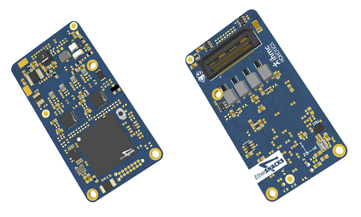
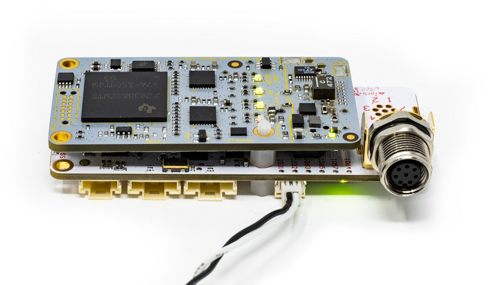
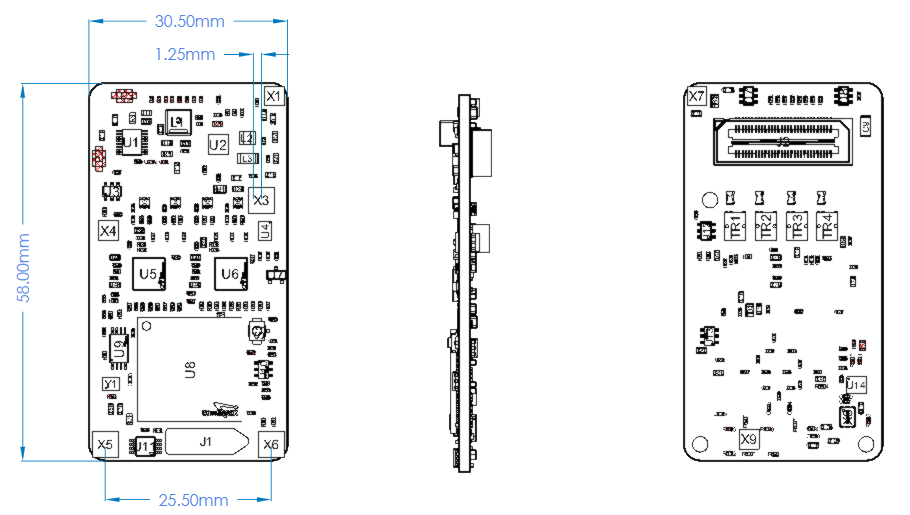
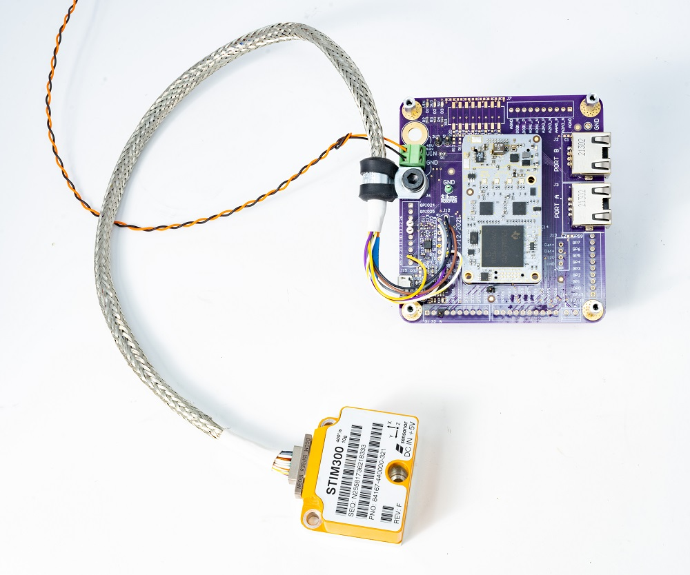

This repository replicates our internal Circuit Board Design Files repository, but only displays a portion of the material and documentation we intend to make public.

Each board has its own folder containing the source files (schematic and layout on Altium), output files (gerber, BOM and pick and place for manufacturing), documents (schematic and layout in PDF files), iamges, configuration files etc.

This project is  is licensed under the BSD 3-Clause "New" or "Revised" License.

EtherSNACKS - EtherCAT slave using Texas Instrument F28388 Processor
===
# Overview
EtherSNACKS board is an etherCAT slave based on the F28388D C2000 Real-time microcontroller. It allows any sensors or actuators to be interfaced on EtherCAT using GPIO, ADC, I2C, SPI, UART, CAN...
  

### Hardware release (production files)
* Rev 1.0 Initial version 

* Rev 1.1 Released version to fab with 8 layers stackup

* Rev 1.2 Change resistor R77 ADC REF to 100R instead of 1K 
		  Reverse voltage protection diode added

### Features
* TMS320F28388D 200 MHz dual C28xCPUs and dual CLAs, Connectivity Manager (CM) based on the ARM Cortex-M4 processor 125Mhz
* EtherCAT build-in and CAN-FD communication ports(CAN needs an external transceiver)
* IMU 6-axes TDK ICM-42688-P High-Precision with 32,768KHz external clock
* Ambient temperature sensor
* Voltage supervisors (3V3 and 1V2 CPU)
* ADC reference 3V ±0.05%
* 2 programmable LEDs
* Reset button
* JTAG 14-pin Plug-of-Nails (TC2070-IDC-NL)
* Boad-to-board 60 pins connector:
	* 2-port EtherCAT
	* 1-port CAN-FD
	* 2x I2C
	* 8x PWM (4*2 complementary PWM)
	* 3x SPI
	* 8x ADC
	* 2x SCI (UART)
	* up to 39 GPIOs (depending on the config)

### Electrical specifications
* Wide input voltage range: 8V to 60V
* Onboard buck 5V 1.2A
* Onboard buck 3V3 800mA

### Mechanical dimensions
* 58mm x 30.5mm (2.28" X 1.2")
* Height≈7.75mm

### Examples
Onboard TDK ICM-42688P IMU on EtherCAT (TwinCAT):

STIM318 IMU interfaced with EtherSNACKS:

EtherSNACKS Testbed for development:

