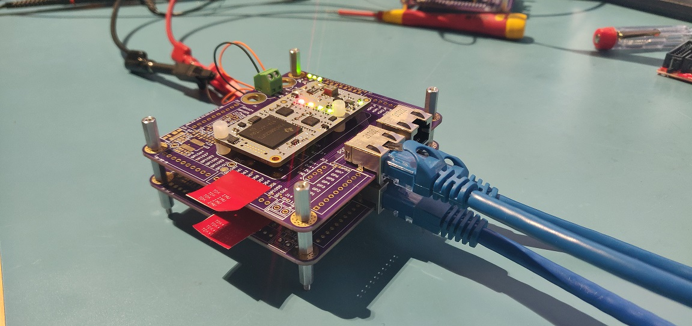

EtherSNACKS - EtherCAT slave using F28388 Processor
===
# Overview
EtherSNACKS board is an etherCAT slave based on the F28388D C2000 Real-time microcontroler. It allows any sensors or actuators to be interfaced on EtherCAT using GPIO, ADC, I2C, SPI, UART, CAN...
  

### Hardware release (production files)
* Rev 1.0 Initial version 

* Rev 1.1 Released version to fab with 8 layers stackup

* Rev 1.2 Change resistor R77 ADC REF to 100R instead of 1K (not released yet 6/29/2022)

### Features
* TMS320F28388D 200 MHz dual C28xCPUs and dual CLAs, Connectivity Manager (CM) based on the ARM Cortex-M4 processor 125Mhz
* EtherCAT build-in and CAN-FD communication ports(CAN needs an external transceiver)
* IMU 6-axes TDK ICM-42688-P High-Precision with 32,768KHz external clock
* Ambient temperature sensor
* Voltage supervisors (3V3 and 1V2 CPU)
* ADC reference 3V ±0.05%
* 2 programmable LEDs
* Reset button
* JTAG 14-pin Plug-of-Nails (TC2070-IDC-NL)
* Boad-to-board 60 pins connector:
	* 2-port EtherCAT
	* 1-port CAN-FD
	* 2x I2C
	* 8x PWM (4*2 complementary PWM)
	* 3x SPI
	* 8x ADC
	* 2x SCI (UART)
	* up to 39 GPIOs (depending on the config)

### Electrical specifications
* Wide input voltage range: 8V to 60V
* Onboard buck 5V 1.2A
* Onboard buck 3V3 800mA

### Mechanical dimensions
* 58mm x 30.5mm (2.28" X 1.2")
* Height≈7.75mm

### Examples
Onboard TDK ICM-42688P IMU on EtherCAT (TwinCAT):

STIM318 IMU interfaced with EtherSNACKS:

EtherSNACKS Testbed for development:

